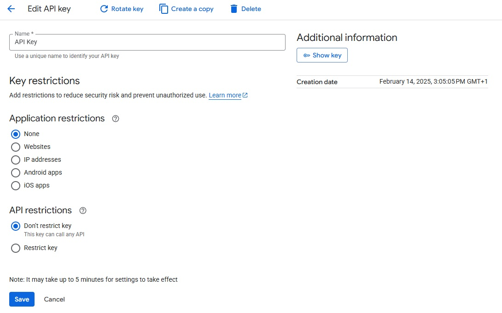
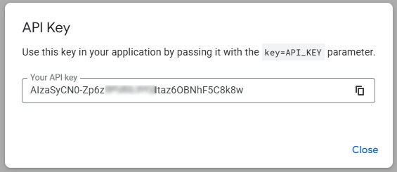
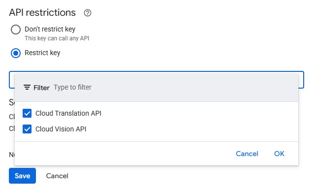
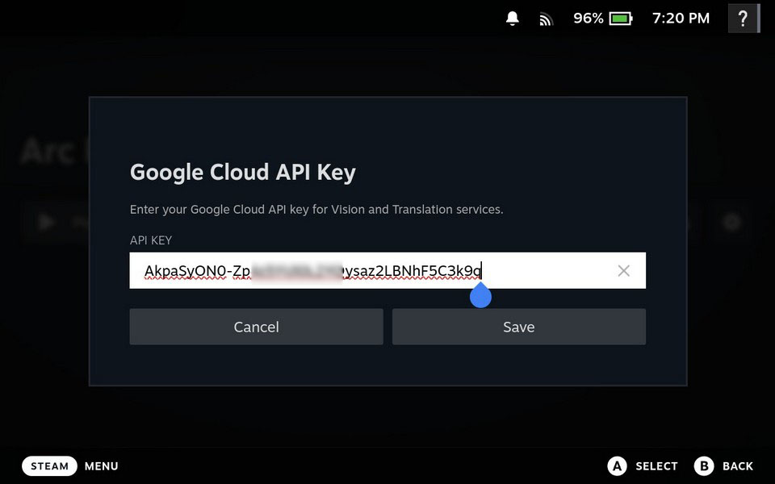
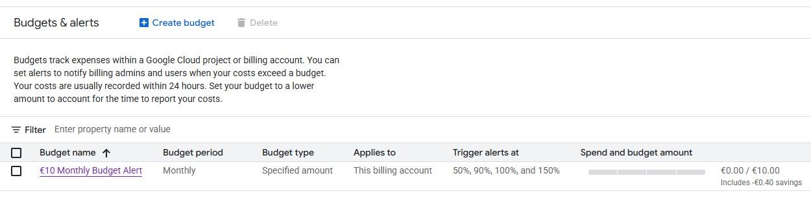

  

A [Decky Loader](https://github.com/SteamDeckHomebrew/decky-loader) plugin that lets you translate any text on your Steam Deck screen.

It captures your screen, recognizes text using OCR, translates it and then shows the result with screen overlay.

Might be helpful for learning a new language by playing games or some other purposes (you tell me!).

## Requirements

- Steam Deck (LCD or OLED)
- [Decky Loader](https://github.com/SteamDeckHomebrew/decky-loader) installed
- Internet connection for text recognition and translation services

## Installation

### From Decky Plugin Store
*Coming soon*

### Manual Installation
1. [Download](https://github.com/cat-in-a-box/Decky-Translator/releases/latest/download/Decky.Translator.zip) the latest release from the [Releases](https://github.com/cat-in-a-box/decky-translator/releases) page
2. Upload *Decky.Translator.zip* archive to any directory on your Steam Deck
3. Open Decky Loader settings and go to Developer section
4. Install Plugin from ZIP file -> "Browse" and then select *Decky.Translator.zip*
5. Open Decky menu and select "Decky Translator"
6. Enjoy!

## How to use it?

1. Press "Translate" button in the main tab of the plugin
2. Press (...) to open the menu again and press "Close Overlay"

## How to quickly use it?

1. Hold L4 button for a Quick Translation
2. Hold L4 button again to disable the translation overlay

Button or Combinations can be configured in the Controls tab

## How does it do that? 

Decky Translator allows you to choose different Text Recognition and Translation methods - feel free to experiment.

### Text Recognition (OCR)

| Provider                                                   | Description                                                                                       | Requirements        |
|------------------------------------------------------------|---------------------------------------------------------------------------------------------------|---------------------|
| [**RapidOCR**](https://github.com/RapidAI/RapidOCR)        | On-device OCR. Screenshots never leave your device                                                | -                   |
| [**OCR.space**](https://ocr.space/)                        | Free EU-based Cloud OCR API with some usage limitations. Good choice if you dont need to translate very often | Internet            |
| [**Google Cloud Vision**](https://cloud.google.com/vision) | Best accuracy and speed. Great for complex/stylized text. Has a great free tier, but requires some setup | Internet + API key  |

### Translation

| Provider                                                           | Description                    | Requirements       |
|--------------------------------------------------------------------|--------------------------------|--------------------|
| [**Google Translate**](https://translate.google.com/)              | It's Google. And it translates | Internet           |
| [**Google Cloud Translation**](https://cloud.google.com/translate) | High quality translations      | Internet + API key |

### AI Explanation

After each translation, you can get an AI-powered breakdown of the source text — word-by-word meanings, grammar notes, idioms, and cultural context. Great for language learners.

| Provider | Models | Requirements |
|---|---|---|
| [**Google Gemini**](https://ai.google.dev/) | Gemini 2.5 Flash, 2.0 Flash, 2.5 Pro | Internet + API key (free tier available) |
| [**OpenAI**](https://platform.openai.com/) | GPT-4o Mini, GPT-4o, GPT-4.1 Mini, GPT-4.1 Nano | Internet + API key |

#### How to set up AI Explanation

1. Open the plugin and go to the **Translation** tab
2. Enable the **AI Explanation** toggle
3. Select your **AI Provider** (Google Gemini or OpenAI)
4. Select a **Model** (Gemini 2.5 Flash is recommended — fast and free)
5. Tap the key icon to enter your API key
   - **Gemini**: Get a free key at [aistudio.google.com/apikey](https://aistudio.google.com/apikey) (15 requests/min free)
   - **OpenAI**: Get a key at [platform.openai.com/api-keys](https://platform.openai.com/api-keys) (paid)

#### How to use AI Explanation

1. Trigger a translation as usual (button hold or menu)
2. Once the translation overlay appears, **tap on any translated text region**
3. The AI explanation will load and show the word-by-word breakdown
4. The explanation adapts to your selected input language — it only breaks down words from the source language

**Note:** Google Cloud services require an API key but offer a generous free tier for personal use.

<h2>Hey, I want better results. How do I get this Google Cloud API Key?</h2>

### Step 1: Create a Google Cloud Project
1. Go to [Google Cloud Console](https://console.cloud.google.com/)
2. Click "Select a project" at the top, then "New Project"
3. Give your project a name (any name would work) and click "Create"

### Step 2: Enable Required APIs
1. Go to [APIs & Services > Library](https://console.cloud.google.com/apis/library)
2. Search for and enable:
   - **Cloud Vision API**
   - **Cloud Translation API**

### Step 3: Create an API Key
1. Go to [APIs & Services > Credentials](https://console.cloud.google.com/apis/credentials)
2. Click "Create Credentials" > "API Key"
   - *Authenticate API calls through a service account*: keep unchecked
   - Application Restrictions: None
3. Copy your new API key
4. If you need to find this API key later - press "Show key" button

### Step 4: (Optional) Restrict Your API Key
For security, you can restrict the API key to only the Vision and Translation APIs:
1. Click on your API key in the Credentials page
2. Under "API restrictions", select "Restrict key"
3. Select "Cloud Vision API" and "Cloud Translation API"
4. Click "Save"

### Step 5: Add API Key to Plugin
1. Open the Decky Translator plugin on your Steam Deck
2. Go to the Translation tab
3. Select Google Cloud Vision and/or Google Cloud Translation as your providers
4. Click "Set Key"
5. Enter your Google Cloud API key
6. Click "Save"

### API Key usually looks like this (but you should have your own):

### IMPORTANT: NEVER SHARE THIS API KEY WITH ANYONE!

### Pricing Note
Google Cloud offers a free tier that should be sufficient for personal use:
- **Vision API**: First 1,000 units/month free
- **Translation API**: First 500,000 characters/month free

**From my own experience**, even everyday usage of Decky Translator with Google Cloud for both recognition and translation rarely goes beyond their free tier. 
Only once I had to pay around 1€/month - and that was during VERY active development and testing phase. 

**But if you want to stay on the safe side anyway** - you could set up a budget limit and notification in [Billing > Budgets & Alerts](https://console.cloud.google.com/billing/budgets)

## Troubleshooting

### Black screen on capture
- Try triggering translation again
- If persistent, reboot your Steam Deck

### Translated text is too small
- Try increasing the "Font Scaling" option in plugin settings

### Plugin says I'm using a wrong API key
- Double-check that you entered it correctly. If the issue persists, please raise an issue - let's investigate it together

### I see nothing / Recognition is bad
- Try other text recognition methods - RapidOCR may not work well with stylized or pixelated text. I also plan to continuously improve recognition quality, so you can expect improvements over time

## To-Do
### Functional
- [x] Add offline OCR functionality
- [x] Fix interface scaling issues on non-default SteamOS values (experimental)
- [x] Rework temporary files solution
- [x] Gamepad support
- [x] Overlay font scaling for large monitors
- [ ] Fully offline Translation functionality
- [ ] Disable in-game buttons while overlay is active
- [ ] Desktop mode support
- [ ] Nicer look for translation overlay
- [ ] TTS for translated text (press the translated label to listen)

### Languages
- [ ] Arabic support for RapidOCR
- [ ] Hindi support for RapidOCR
- [x] Add Finnish language
- [x] Add Romanian language
- [x] Add Bulgarian language
- [x] Add Vietnamese language

<h2>Third-Party Dependencies</h2>

This plugin downloads and uses the following third-party components:

### RapidOCR Models (PP-OCRv5)

Based on [PaddleOCR](https://github.com/PaddlePaddle/PaddleOCR) models (Apache 2.0), exported to ONNX format.

- Text Detection + Chinese Recognition: [MeKo-Christian/paddleocr-onnx](https://github.com/MeKo-Christian/paddleocr-onnx)
- Chinese Dictionary + per-language Recognition models: [monkt/paddleocr-onnx](https://huggingface.co/monkt/paddleocr-onnx) (Apache 2.0)
- Text Classifier: [SWHL/RapidOCR](https://huggingface.co/SWHL/RapidOCR) (Apache 2.0)

| File | Purpose |
|------|---------|
| ch_PP-OCRv5_mobile_det.onnx | Text detection model (shared across all languages) |
| ch_rec.onnx + ch_dict.txt | Chinese/Japanese/English recognition |
| english_rec.onnx + english_dict.txt | English recognition |
| latin_rec.onnx + latin_dict.txt | Latin script (French, German, Spanish, etc.) |
| eslav_rec.onnx + eslav_dict.txt | East Slavic (Russian, Ukrainian) |
| korean_rec.onnx + korean_dict.txt | Korean recognition |
| greek_rec.onnx + greek_dict.txt | Greek recognition |
| thai_rec.onnx + thai_dict.txt | Thai recognition |
| ch_ppocr_mobile_v2.0_cls_infer.onnx | Text direction classifier |

### Python Packages (from PyPI)

| Package | License | Purpose |
|---------|---------|---------|
| Pillow==11.2.1 | MIT-CMU | Image processing for screenshot handling |
| requests==2.32.3 | Apache 2.0 | HTTP library for API calls |
| urllib3==2.4.0 | MIT | HTTP client (dependency of requests) |
| rapidocr>=3.6.0 | Apache 2.0 | OCR engine that runs the PP-OCRv5 ONNX models |
| onnxruntime>=1.7.0 | MIT | ONNX model inference runtime |

## Support

If you find this plugin useful - feel free to buy me a cup of coffee ❤️

## Thanks to

- [Valve](https://www.valvesoftware.com/) for creating the Steam Deck - a beautiful device that makes projects like this possible
- [UGT (Universal Game Translator)](https://github.com/SethRobinson/UGT) by Seth Robinson for inspiration and the idea of using game translation as a language learning tool
- [Decky Loader](https://github.com/SteamDeckHomebrew/decky-loader) team for the plugin framework
- [Steam Deck Homebrew](https://github.com/SteamDeckHomebrew) community for their amazing plugins, which served as a great reference while building this one
- [PaddleOCR](https://github.com/PaddlePaddle/PaddleOCR), [RapidOCR](https://github.com/RapidAI/RapidOCR) and [MeKo-Christian](https://github.com/MeKo-Christian/paddleocr-onnx) for OCR engine, OCR models and ONNX model exports that make offline text recognition possible
- [OCR.space](https://ocr.space/) for the free OCR API
- [Google Cloud](https://cloud.google.com/) for Vision and Translation API
- And You. Yes, You 😉