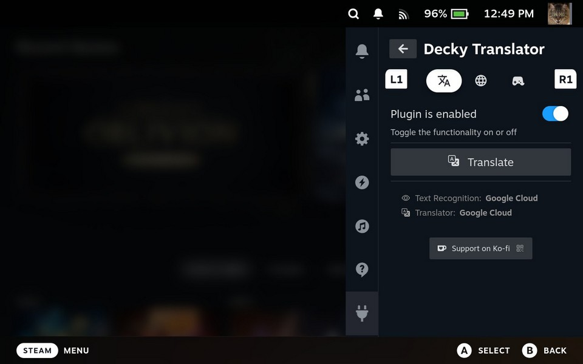
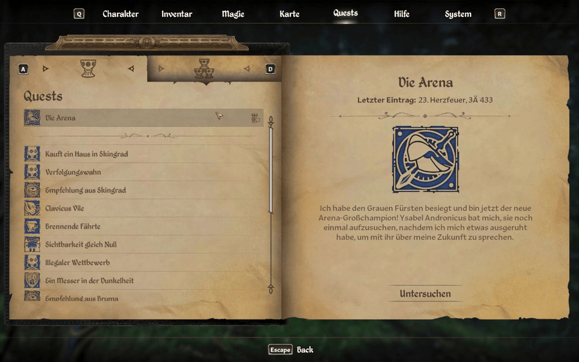

  

A [Decky Loader](https://github.com/SteamDeckHomebrew/decky-loader) plugin that lets you translate any text on your Steam Deck screen.

It captures your screen, recognizes text using OCR, translates it and then shows the result with screen overlay.

Might be helpful for learning a new language by playing games or some other purposes (you tell me!).

## Requirements

- Steam Deck (LCD or OLED)
- [Decky Loader](https://github.com/SteamDeckHomebrew/decky-loader) installed
- Internet connection for text recognition and translation services

## Installation

### From Decky Plugin Store
*Coming soon*

### Manual Installation
1. Download the latest release from the [Releases](https://github.com/cat-in-a-box/decky-translator/releases) page
2. Upload the zip archive to any directory on your Steam Deck
3. Open Decky Loader settings and go to Developer section
4. Install Plugin from ZIP file -> "Browse" and then select .zip file
5. Open Decky menu and select "Decky Translator"
6. Enjoy!

## How to use it?

1. Press "Translate" button in the main tab of the plugin
2. Press (...) to open the menu again and press "Close Overlay"

## How to quickly use it?

1. Hold L4 button for a Quick Translation
2. Hold L4 button again to disable the translation overlay

Button or Combinations can be configured in the Controls tab

## How does it do that? 

Decky Translator allows you to choose different Text Recognition and Translation services to suit your needs.

### Text Recognition (OCR)

| Provider                                                   | Description                                                                                                   | Requirements        |
|------------------------------------------------------------|---------------------------------------------------------------------------------------------------------------|---------------------|
| [**RapidOCR**](https://github.com/RapidAI/RapidOCR)        | On-device OCR. Screenshots never leave your device                                                            | -                   |
| [**OCR.space**](https://ocr.space/)                        | Free EU-based Cloud OCR API with some usage limitations. Good choice if you dont need to translate very often | Internet            |
| [**Google Cloud Vision**](https://cloud.google.com/vision) | Best accuracy and speed. Great for complex/stylized text. Has a great free tier, but requires some setup      | Internet + API key  |

### Translation

| Provider                                                           | Description                    | Requirements |
|--------------------------------------------------------------------|--------------------------------|--------------|
| [**Google Translate**](https://translate.google.com/)              | It's Google. And it translates | Internet     |
| [**Google Cloud Translation**](https://cloud.google.com/translate) | High quality translations      | API key      |

**Note:** Google Cloud services require an API key but offer a generous free tier for personal use. 

<h2>Hey, I want better results. How do I get this Google Cloud API Key?</h2>

You'll need a Google Cloud API key:

### Step 1: Create a Google Cloud Project
1. Go to [Google Cloud Console](https://console.cloud.google.com/)
2. Click "Select a project" at the top, then "New Project"
3. Give your project a name (any name would work) and click "Create"

### Step 2: Enable Required APIs
1. Go to [APIs & Services > Library](https://console.cloud.google.com/apis/library)
2. Search for and enable:
   - **Cloud Vision API**
   - **Cloud Translation API**

### Step 3: Create an API Key
1. Go to [APIs & Services > Credentials](https://console.cloud.google.com/apis/credentials)
2. Click "Create Credentials" > "API Key"
3. Copy your new API key

### Step 4: (Optional) Restrict Your API Key
For security, you can restrict the API key to only the Vision and Translation APIs:
1. Click on your API key in the Credentials page
2. Under "API restrictions", select "Restrict key"
3. Select "Cloud Vision API" and "Cloud Translation API"
4. Click "Save"

### Step 5: Add API Key to Plugin
1. Open the Decky Translator plugin on your Steam Deck
2. Go to the Translation tab
3. Select Google Cloud Vision and/or Google Cloud Translation as your providers
4. Click "Set Key"
5. Enter your Google Cloud API key
6. Click "Save"

### IMPORTANT: NEVER SHARE THIS API KEY WITH ANYONE!

### Pricing Note
Google Cloud offers a free tier that should be sufficient for personal use:
- **Vision API**: First 1,000 units/month free
- **Translation API**: First 500,000 characters/month free

Check [Google Cloud Pricing](https://cloud.google.com/pricing) for current rates.

## Troubleshooting

### Black Screen on Capture
- Try triggering translation again
- If persistent, reboot Steam Deck

## To-Do
- [x] Add local/offline translation functionality
- [ ] Disable in-game buttons while overlay is active
- [x] Fix interface scaling issues on non-default SteamOS values
- [x] Rework temporary files solution
- [ ] External gamepad support
- [ ] Desktop mode support
- [ ] Nicer look for translation overlay

<h2>Third-Party Dependencies</h2>

This plugin downloads and uses the following third-party components:

### Python 3.11 (required by RapidOCR)
- Source: [astral-sh/python-build-standalone](https://github.com/astral-sh/python-build-standalone)
- URL: https://github.com/astral-sh/python-build-standalone/releases/download/20251010/cpython-3.11.14+20251010-x86_64-unknown-linux-gnu-install_only_stripped.tar.gz
- SHA256: `e84da4b01a4017222ed3d172f4ba261c930cca40b7db5d6ad97149a41b98a14c`

### RapidOCR Models
- Source: [SWHL/RapidOCR on Hugging Face](https://huggingface.co/SWHL/RapidOCR)

| File | Purpose |
|------|---------|
| [ch_PP-OCRv4_det_infer.onnx](https://huggingface.co/SWHL/RapidOCR/resolve/main/PP-OCRv4/ch_PP-OCRv4_det_infer.onnx) | Text detection model - finds where text is located in the image |
| [ch_PP-OCRv4_rec_infer.onnx](https://huggingface.co/SWHL/RapidOCR/resolve/main/PP-OCRv4/ch_PP-OCRv4_rec_infer.onnx) | Text recognition model - reads the actual characters from detected regions |
| [ch_ppocr_mobile_v2.0_cls_train.onnx](https://huggingface.co/SWHL/RapidOCR/resolve/main/PP-OCRv3/ch_ppocr_mobile_v2.0_cls_train.onnx) | Text direction classifier - corrects orientation of rotated/upside-down text |
| [ppocr_keys_v1.txt](https://huggingface.co/SWHL/RapidOCR/resolve/main/PP-OCRv4/ppocr_keys_v1.txt) | Character dictionary - list of all recognizable characters |

### Python Packages (from PyPI)

| Package | Purpose |
|---------|---------|
| Pillow==11.2.1 | Image processing library for screenshot handling |
| requests==2.32.3 | HTTP library for API calls to translation services |
| urllib3==2.4.0 | HTTP client (dependency of requests) |
| rapidocr-onnxruntime>=1.3.0 | OCR engine that runs the ONNX models |

## Support

If you find this plugin useful - feel free to buy me a cup of coffee ❤️

## Thanks to

- [Valve](https://www.valvesoftware.com/) for creating the Steam Deck - a beautiful device that makes projects like this possible
- [UGT (Universal Game Translator)](https://github.com/SethRobinson/UGT) by Seth Robinson for inspiration and the idea of using game translation as a language learning tool
- [Decky Loader](https://github.com/SteamDeckHomebrew/decky-loader) team for the plugin framework
- [Steam Deck Homebrew](https://github.com/SteamDeckHomebrew) community for plugin development guides
- [OCR.space](https://ocr.space/) for the free OCR API
- [Google Cloud](https://cloud.google.com/) for Vision and Translation APIs
- And You. Yes, You 😉